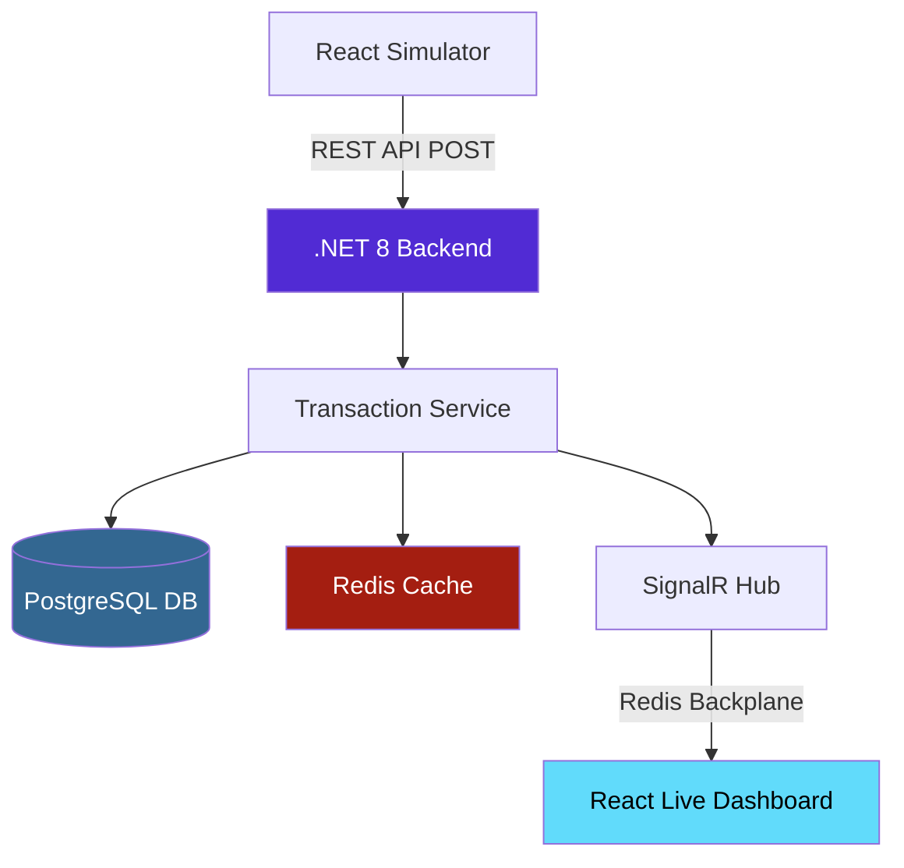
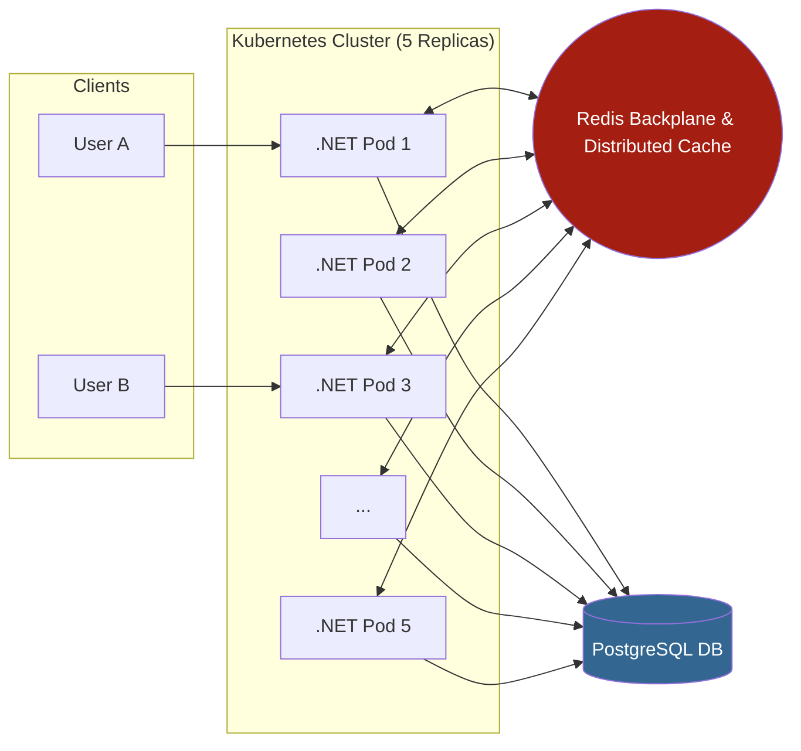

# Real-Time Financial Monitor (MVP)

##  Overview
This system is a high-performance, real-time transaction monitoring solution. It handles financial data ingestion via REST APIs, processes transactions asynchronously, and broadcasts live updates to connected clients using SignalR WebSockets.

The project is built with a focus on **Scalability**, **Concurrency Safety**, and **Modern DevOps practices**.

---
## System Architecture


## Distributed Challenge

---

##  Architecture & Tech Stack

### Backend (.NET 8)
- **Minimal APIs**: Optimized for high-throughput and low latency.
- **SignalR & Redis Backplane**: Enables real-time synchronization across multiple server instances (Pods).
- **Entity Framework Core**: Persistent storage using PostgreSQL with thread-safe service scoping.
- **FluentValidation**: Robust input validation to ensure data integrity.

###  Architectural Refactoring 
- **Notifier Service Pattern**: Decoupled the business logic from SignalR by implementing `IClientNotifierService`.
- **Separation of Concerns**: The `TransactionService` remains focused on financial logic while infrastructure details (WebSockets) are isolated.
- **Testability**: This abstraction allowed for cleaner unit tests using Moq.

### Frontend (React 19 + TypeScript)
- **Redux Toolkit**: Efficient state management for real-time data streams.
- **SignalR Client**: Live socket connection for instant UI updates.
- **Vite**: Modern build tool for optimized frontend performance.

###  Caching Layer (Performance Optimization)
To meet high-performance requirements, the system implements a **Distributed Cache** using Redis:
- **Fast Lookups:** The most recent transactions are cached to minimize DB hits.
- **Thread-Safe Access:** Implemented using `SemaphoreSlim` to ensure data integrity during concurrent cache updates.
- **Consistency:** Automatic cache invalidation on every write operation ensures the dashboard always reflects the latest state.

---

##  Distributed Architecture (The Challenge)
**The Problem:** In a production environment with multiple replicas (e.g., 5 Kubernetes Pods), a client connected to Pod A would not normally receive updates triggered by a transaction processed on Pod B.

**The Solution:** I implemented a Redis Backplane.
- All SignalR instances connect to a central Redis pub/sub.
- When a transaction status changes, the message is broadcasted through Redis to all active Pods.
- This ensures that every client receives real-time updates regardless of which server instance they are connected to.

---

##  Deployment & DevOps

### Docker (Optimized for Production)
The project uses Multi-stage builds to minimize image size and maximize security:
- Build Stage: Uses the full .NET SDK to compile and publish.
- Runtime Stage: Uses the lightweight ASP.NET Runtime image, keeping the final container lean.

### Kubernetes (Scaling to 5 Replicas)
The system is cloud-ready with provided K8s manifests:
- Deployment: Configured with replicas: 5 and environment variables for Redis integration.
- Service: Uses a LoadBalancer to distribute traffic across all running Pods.

---

## Testing & Quality
The solution includes a comprehensive test suite (xUnit + Moq):
- Unit Tests: Validating transaction logic and status transitions.
- Concurrency Tests: Ensuring the system handles multiple simultaneous requests without DB locking issues.
- Validation Tests: Testing edge cases for financial input data.

To run tests:
dotnet test

---

##  Getting Started

### 1. Using Docker Compose (Recommended)
This will spin up the API, the Client, and the Redis server automatically:
```bash
docker-compose up --build
```
### 2. Manual Setup
Backend
```bash
cd FinancialMonitor
dotnet run
```

Frontend
```bash
cd financial-monitor-client
npm install
npm run dev
```

---

##  Performance Highlights
- Service Scoping: Each background task creates its own scope to ensure DbContext is never shared across threads.
- Non-blocking UI: The React dashboard uses optimistic updates and efficient re-rendering to handle high-frequency data bursts.
- Health Checks: The API includes a /health endpoint for Kubernetes liveness/readiness probes.